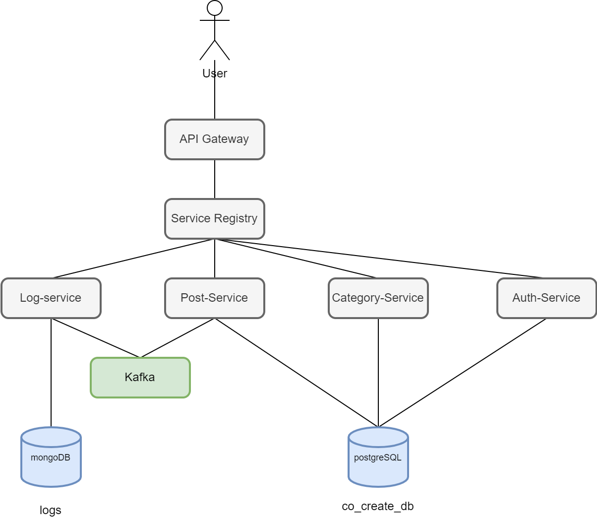
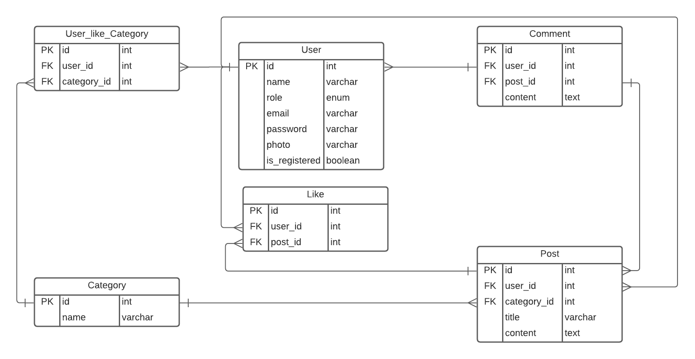

# Final Project BNI Bootcamp

# Banking Innovation CoCreate Platform MVP

## Epic: CoCreate Membership Enrollment

- Anyone on banking team can join to the CoCreate community using email.
- CoCreate platform admin can see the detail of enrollment member
- As a member, they can choose which categories they want
- As a member, they can give/update their basic profile information

## Epic: CoCreate Collaboration

- As a member, they can see all relevant posts for their choosen categories
- As a member, they can see the detail of selected post
- As a member, they can give comment, and like the selected post
- As a member, they can post new article related to new idea/insight/news on particular categories

## Architect Diagram

## ERD

## Technologies

- Spring Boot Framework (2.6.2)
- PostgreSQL (14.1)
- Apache Kafka (2.13)
- JSON Web Token (0.11.2)

## Depedencies

- Lombok
- Discovery
- Spring Boot Actuator
- Spring Web
- Spring Cloud Config
- Spring Cloud Discovery
- Spring Boot DevTools
- PostgreSQL Driver
- Spring Configuration Processor
- Spring for Apache Kafka
- Spring Security
- JSON Web Token Support For The JVM
